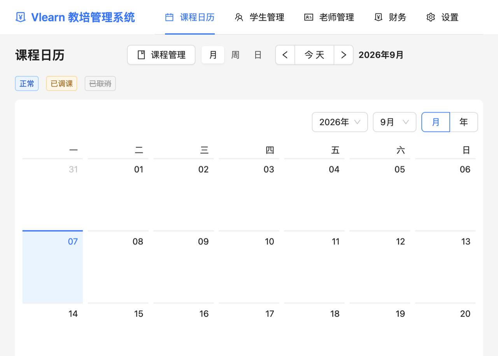
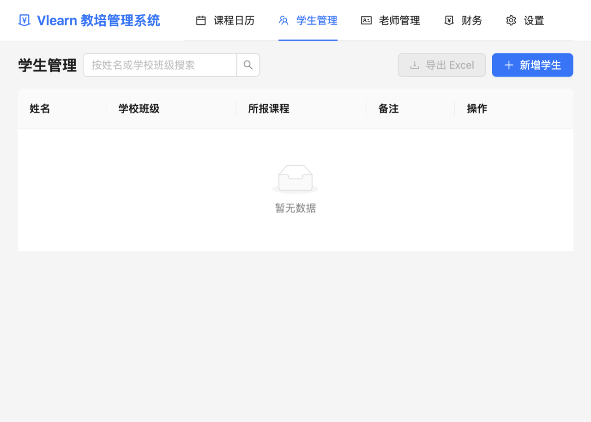
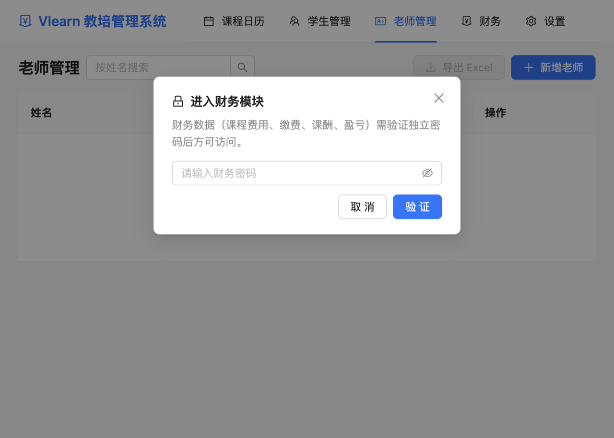
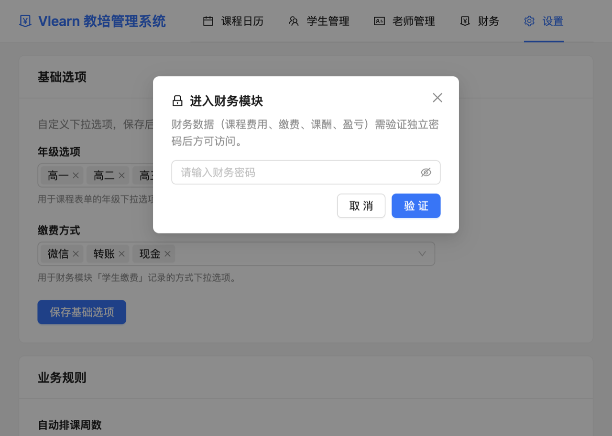

# Vlearn 教培管理系统 · 使用说明书

> 本说明书面向**没有编程基础**的用户。照着步骤做，5 分钟即可上手。
> 程序员开发文档见 [README.md](./README.md)。

---

## 目录

1. [软件简介](#一软件简介)
2. [安装与启动](#二安装与启动)
3. [界面总览](#三界面总览)
4. [快速上手（推荐先做这 5 步）](#四快速上手推荐先做这5步)
5. [教务模块操作指南](#五教务模块操作指南)
6. [财务模块操作指南](#六财务模块操作指南)
7. [系统设置](#七系统设置)
8. [数据安全与备份](#八数据安全与备份)
9. [常见问题 FAQ](#九常见问题-faq)

---

## 一、软件简介

Vlearn 是一款安装在您自己电脑上的**教培机构管理系统**，帮您完成：

- **教务管理**：课程安排、学生档案、老师档案
- **排课日历**：自动按每周上课时间生成课程表，支持临时调课、取消课程
- **考勤管理**：每节课给每个学生点名（出勤/请假/缺勤），一键全员出勤
- **财务管理**：学生缴费、老师课酬、月度盈亏一目了然
- **报表导出**：所有表格都能一键导出 Excel 文件

**三个重要特点：**

1. **数据存在您自己的电脑上**，不需要联网，不会上传到任何服务器；
2. **教务和财务分开**：课程、学生、考勤谁都能看；涉及钱的页面必须输入财务密码才能进入；
3. **操作简单**：所有功能都通过鼠标点击完成，不需要任何代码知识。

---

## 二、安装与启动

### Windows 电脑

1. 打开安装包文件夹，双击 `vlearn-1.0.0-win-x64.exe`；
2. 按提示点击"下一步"完成安装（可以自行选择安装位置）；
3. 安装完成后，双击桌面上的 **Vlearn教培管理系统** 图标启动。

### Mac 电脑

1. 双击 `vlearn-1.0.0-mac-arm64.dmg` 安装包；
2. 把 **Vlearn教培管理系统** 图标拖进"应用程序"文件夹；
3. 在"应用程序"中双击图标启动。
   - 如果提示"无法打开，因为它来自身份不明的开发者"，请**右键点击图标 → 选择"打开" → 再点"打开"**，之后就能正常使用。

启动后稍等几秒，就会看到软件主界面。**第一次打开没有任何数据，是空白的，这是正常的**——跟着下面第 4 节的步骤，先把课程、老师、学生填进去即可。

---

## 三、界面总览

软件顶部有一排菜单，分别是：

| 菜单 | 作用 | 谁能看 |
| --- | --- | --- |
| **课程日历** | 查看课程表、排课、点名 | 教务 |
| **学生管理** | 学生档案、报课、考勤历史 | 教务 |
| **老师管理** | 老师档案、授课统计 | 教务 |
| **财务** | 费用、缴费、课酬、盈亏报表 | 需输入财务密码 |
| **设置** | 修改密码、备份数据、自定义选项 | 所有人 |

右上角出现金色"财务已解锁"标签时，表示财务模块已打开，旁边有"退出财务"按钮可以随时退出。

---

## 四、快速上手（推荐先做这 5 步）

### 第 1 步：添加老师

1. 点击顶部菜单 **「老师管理」**；
2. 点击右上角蓝色 **「新增老师」** 按钮；
3. 输入老师姓名（如"张老师"），点 **「保存」**。

### 第 2 步：添加课程并自动排课

1. 点击顶部菜单 **「课程日历」**；
2. 点击右上角 **「课程管理」** 按钮；
3. 点 **「新增课程」**，填写：
   - **科目**：如"数学"
   - **年级**：下拉选择（如"高一"，选项可以在"设置"里改）
   - **班级号**：如"A1班"
   - **默认授课老师**：选择第 1 步添加的老师
   - **默认上课时间规则**：选择星期几 + 起止时间（如 周二 15:00-17:00），可以点"添加时间段"加多段
4. 点 **「保存」**——系统会**自动生成未来 8 周**的课程表，回到日历就能看到。

### 第 3 步：添加学生

1. 点击顶部菜单 **「学生管理」**；
2. 点右上角 **「新增学生」**；
3. 填写姓名、学校班级，在"所报课程"里勾选第 2 步创建的课程；
4. 点 **「保存」**。

### 第 4 步：给一节课点名

1. 回到 **「课程日历」**，点击日历上的**彩色课程小方块**（例如"15:00 数学·A1班"）；
2. 弹出课程详情窗口，下面就是**学生名单**；
3. 每个学生后面选择：**出勤 / 请假 / 缺勤**，选完立刻生效；
4. 全员都到了，直接点 **「全部出勤」** 按钮，一键搞定。

### 第 5 步：进入财务，设置费用

1. 点击顶部菜单 **「财务」**，输入财务密码；
   - **初始密码：admin123**（请尽快在"设置"中修改）
2. 进入后点击 **「课程费用」**，给每门课填上：
   - **课程费用**：每上一次课向学生收多少钱（如 100 元）；
   - **单次课酬**：每上一次课付给老师多少钱（如 80 元）；
3. 在 **「学生缴费」** 页点 **「自动计算应缴」**，系统会根据考勤自动算出每个学生该交多少钱；
4. 在 **「老师课酬」** 页点 **「自动计算应付」**，自动生成老师的课酬记录。

至此，整套系统已经跑起来了！下面是每个页面的详细说明。

---

## 五、教务模块操作指南

### 5.1 课程日历

日历有 **月 / 周 / 日** 三种视图，用右上角切换：

- **月视图**：一整个月的课程安排；
- **周视图**：某 7 天的课程，点某一天可跳转到当天；
- **日视图**：某一天 8:00-22:00 按时间排列的课程。

彩色方块的颜色含义：

- 🔵 **蓝色**：正常课程
- 🟡 **橙色**：已调课的课程（改过时间/日期/老师）
- ⚪ **灰色划掉**：已取消的课程

**查看与点名**：点击任意课程方块 → 弹出详情窗口 → 显示上课信息 + 学生名单 + 考勤操作。

**单次调课（代课）**：在详情窗口点 **「单次调课」**：
- 修改日期、时间；
- "授课老师"下拉选择代课老师（不改则沿用默认老师）；
- 填备注（如"代课"），点保存。**只影响这一节课**，其他周次不受影响。

**取消一节课**：详情窗口点 **「取消本次课」**（红色按钮），确认即可；想恢复就点 **「恢复本次课」**。

**课程管理**：日历页右上角 **「课程管理」** 按钮，可以新增、编辑、删除课程。
- 修改课程的上课时间规则后，**已经生成的课表不会自动变**；需要点该课程后面的 **「重新生成排课」** 按钮（过去已上过的课不会被删除，只重建今天及以后的课程）。
- **删除课程会同时删除它的所有排课、考勤和缴费记录，且无法撤销**，请谨慎操作。

### 5.2 学生管理

- **新增学生**：姓名（必填）、学校班级（如"高一3班"）、所报课程（可多选）、备注；
- **搜索**：右上角搜索框按姓名快速查找；
- **查看详情**：点击学生姓名 → 弹出抽屉，可以看到：
  - 基本信息；
  - **考勤统计**（出勤/请假/缺勤各多少次）；
  - **考勤历史**（每节课的日期、课程、状态），可以**导出该学生的考勤 Excel**；
- **编辑 / 删除**：表格最后一列操作按钮。删除学生时，该学生的考勤和缴费记录会一并删除。

> 💡 学费信息属于财务数据，学生管理页不会显示，请到「财务」模块查看。

### 5.3 老师管理

- **新增 / 编辑**：姓名、所教课程（可多选）、备注；
- **查看详情**：点击老师姓名 → 可以看到累计授课次数、未来待上课程数；
- **删除**：删除老师后，课程里的"默认老师"会自动清空，不影响历史考勤；
- 老师的**课酬金额属于财务数据**，请到「财务」模块查看。

### 5.4 考勤规则小结

| 状态 | 含义 | 收费规则 |
| --- | --- | --- |
| 出勤 | 正常上课 | 计费 ✅ |
| 请假 | 提前请假没来 | 不计费 ❌ |
| 缺勤 | 没来也没请假 | 默认计费 ✅（可在"设置"中改为不计费） |
| 未标记 | 还没点名 | 不计费 |

---

## 六、财务模块操作指南

### 6.1 进入财务模块

1. 点击顶部菜单 **「财务」**；
2. 弹出密码输入框，输入财务密码（初始 **admin123**）；
3. 验证通过后，顶部会出现第二排菜单：**仪表盘 / 课程费用 / 学生缴费 / 老师课酬 / 盈亏报表**；
4. 用完点右上角 **「退出财务」** 关闭财务权限。

> ⚠️ 请务必修改初始密码：**「设置」→「修改财务密码」**（需要先输入旧密码）。密码请自己记牢。

### 6.2 仪表盘

进入财务后的首页，显示**本月**的经营数据，可点右上角切换月份：

| 卡片 | 含义 |
| --- | --- |
| 本月学生应缴总额 | 这个月学生一共应该交多少钱 |
| 本月学生实缴总额 | 这个月实际收到了多少钱 |
| 本月老师应付总额 | 这个月应该付给老师多少钱 |
| 本月老师实付总额 | 这个月实际付了多少钱 |
| 本月盈亏 | 实缴 - 实付（绿色赚钱，红色亏损） |

> 统计按记录上的"缴费/支付日期"所在月份计算。

### 6.3 课程费用

在课程列表里直接**点击"编辑"按钮行内修改**两个金额，再点"保存"：

- **课程费用**：每上一次课向学生收的钱，用于计算学生应缴；
- **单次课酬**：每上一次课付给老师的钱，用于计算老师应付。

### 6.4 学生缴费

- **新增记录**：选择学生 → 选择课程（只显示该学生报过的课）→ 系统自动填入"应缴金额"（= 课程费用，可手动改）→ 填实缴金额 → 选择缴费方式（微信/转账/现金，可在设置中增加）→ 选择缴费日期 → 保存；
- **自动计算应缴**（重点按钮）：根据**考勤数据**自动算出每个学生每门课的应缴金额：
  - 应缴 = 课程费用 × 计费次数（出勤计费、请假免费、缺勤按设置）
  - 已经填过的"实缴金额"**不会被覆盖**，可放心反复点击；
- **筛选**：按学生或课程过滤表格；**导出**：导出的内容和当前筛选结果一致；
- **编辑 / 删除**：表格最后一列操作按钮。

### 6.5 老师课酬

- **新增记录**：选择老师 → 选择课程实例（显示"日期 + 课程 + 时间"）→ 自动填入"应付金额"（= 单次课酬，可手动改）→ 填实付金额、支付日期 → 保存；
- **自动计算应付**（重点按钮）：为每节未取消的课生成一条课酬记录，金额取课程的单次课酬；**代课老师会拿到这节课的课酬**；
- **筛选**：按老师或课程过滤；**导出**：与筛选结果一致。

### 6.6 盈亏报表

- 选择年份，按月查看：**收入（学生实缴）、支出（老师实付）、净盈亏**；
- 最后一行"合计"是全年汇总；
- 点 **「导出 Excel」** 把报表保存到电脑上。

---

## 七、系统设置

点顶部菜单 **「设置」**，共 5 个板块：

| 板块 | 功能 |
| --- | --- |
| **基础选项** | 修改**年级选项**（如增加"复读"）和**缴费方式**（如增加"刷卡"）。直接在下拉框里输入新选项按回车即可添加。改完点"保存" |
| **业务规则** | ① 自动排课周数（新建课程时提前生成几周的课表，默认 8 周）② 缺勤是否收费（关闭后，缺勤不算钱；请假始终不收费）。改完点"保存" |
| **财务密码** | 修改财务密码：输入当前密码 → 新密码（至少 6 位）→ 确认新密码 → 保存。初始密码 admin123 |
| **数据备份与恢复** | 见下一节 |
| **关于** | 软件版本说明 |

---

## 八、数据安全与备份

### 数据存在哪里

所有数据保存在您电脑上的一个数据库文件里，**不联网、不上传**。卸载软件前请务必先备份。

### 如何备份（强烈建议每周做一次）

1. 打开 **「设置」→「数据备份与恢复」**；
2. 点 **「备份数据」**，选择保存位置（建议放到 U 盘或云盘文件夹），点保存；
3. 备份文件名为 `Vlearn_数据备份_日期.db`。

### 如何恢复（换电脑 / 误删数据时）

1. 打开 **「设置」→「数据备份与恢复」**；
2. 点 **「恢复数据」**，选择之前的备份文件；
3. 确认后软件会自动刷新，数据恢复完成。

> ⚠️ 恢复会用备份文件**覆盖当前全部数据**。恢复前建议先把现有数据也备份一份。

### 数据备份到新电脑

在新电脑上安装 Vlearn 后，把备份文件拷过去，用上面的"恢复"步骤即可完整迁移。

---

## 九、常见问题 FAQ

**Q1：忘了财务密码怎么办？**
A：财务密码用于保护钱款数据，软件内无法自助找回。请联系您的技术人员：备份数据库后删除设置中的密码记录并重启软件，密码即恢复为初始 `admin123`（此操作需技术人员在后台完成，见 README.md 安全说明）。

**Q2：修改了课程的上课时间，课表没变？**
A：已生成的课表不会自动变化。在「课程日历 → 课程管理」里点该课程的 **「重新生成排课」**。

**Q3：学生中途才报名，之前的课没有考勤记录怎么办？**
A：进入任意一节该课程的课，详情里的名单是**实时读取当前报名学生**的，新学生会出现，直接补点名即可。"自动计算应缴"只按已有考勤记录算钱，不会多算。

**Q4：请假的学生会收费吗？**
A：不会。请假不计费；缺勤默认计费，可在「设置 → 业务规则」中改为不计费。

**Q5：为什么学生管理页看不到学费信息？**
A：设计如此——涉及钱的信息全部收在「财务」模块里，输入财务密码才能看到，防止无关人员（如前台）看到财务数据。

**Q6：导出的 Excel 在哪里？**
A：点"导出 Excel"后会弹出保存窗口，由您选择保存位置。文件名格式：`Vlearn_模块名_日期.xlsx`。

**Q7：可以同时在两台电脑上使用同一份数据吗？**
A：这是单机软件，数据不共享。多人协作建议指定一台电脑为"主电脑"，定期备份后在其他电脑上恢复使用。

**Q8：电脑重装系统了，数据还在吗？**
A：只要备份文件还在，数据就还在——重装后用"恢复数据"功能导入即可。**再次提醒：养成定期备份的习惯。**

---

祝您使用愉快！如有其他问题，请联系软件提供方。
