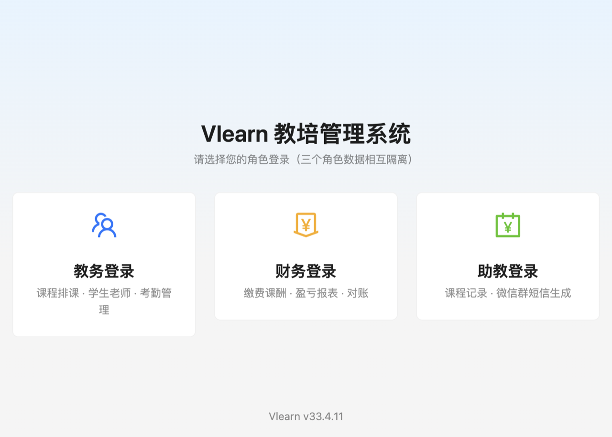
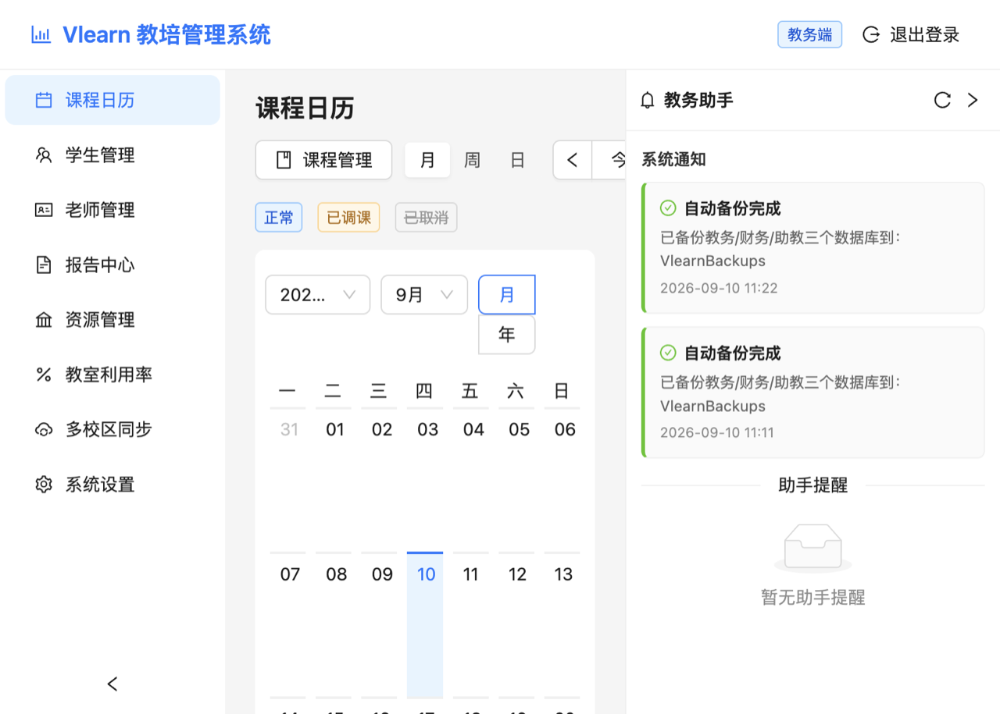
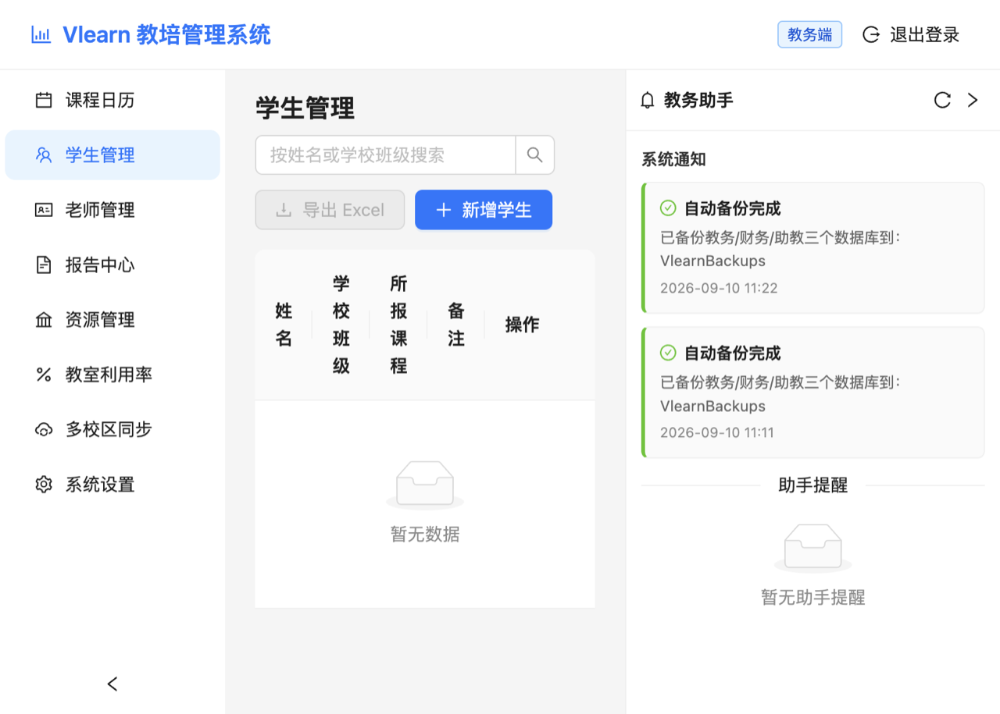
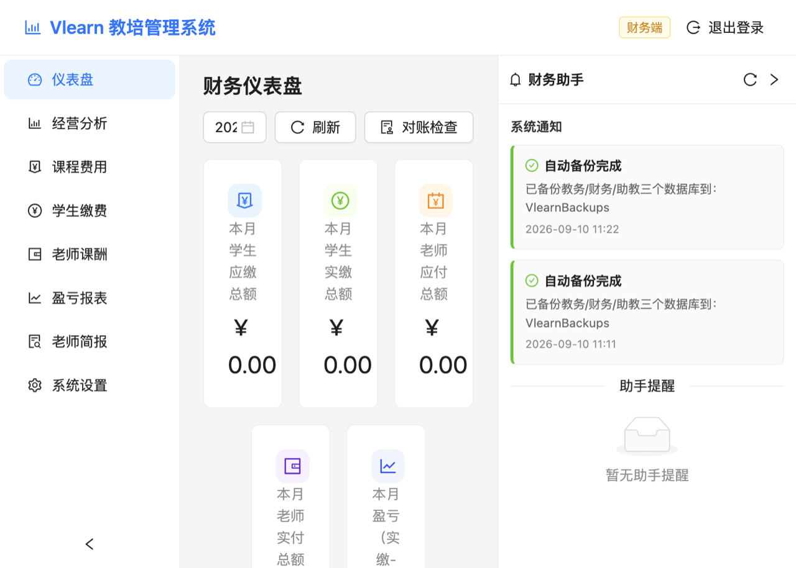
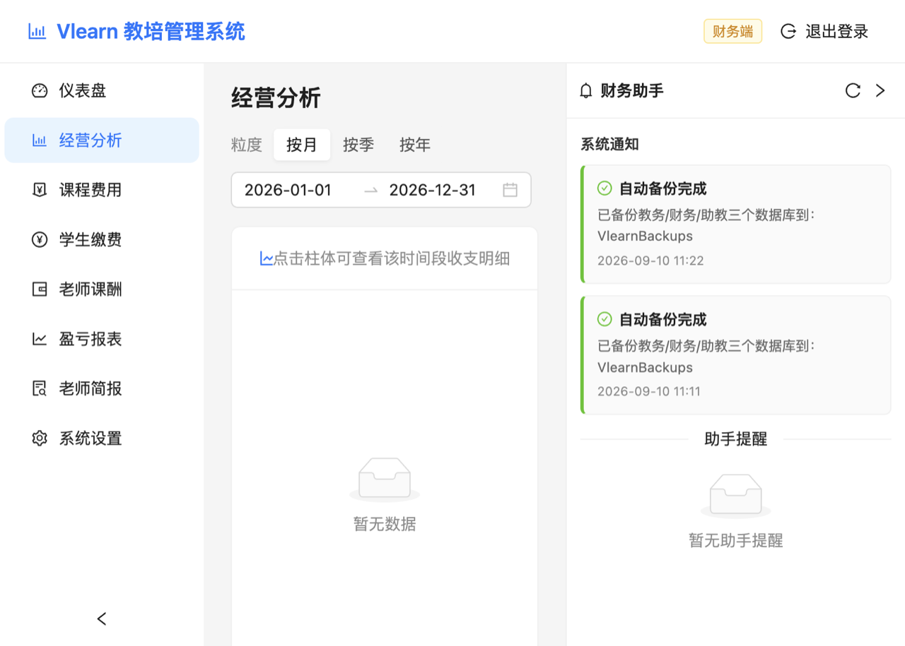
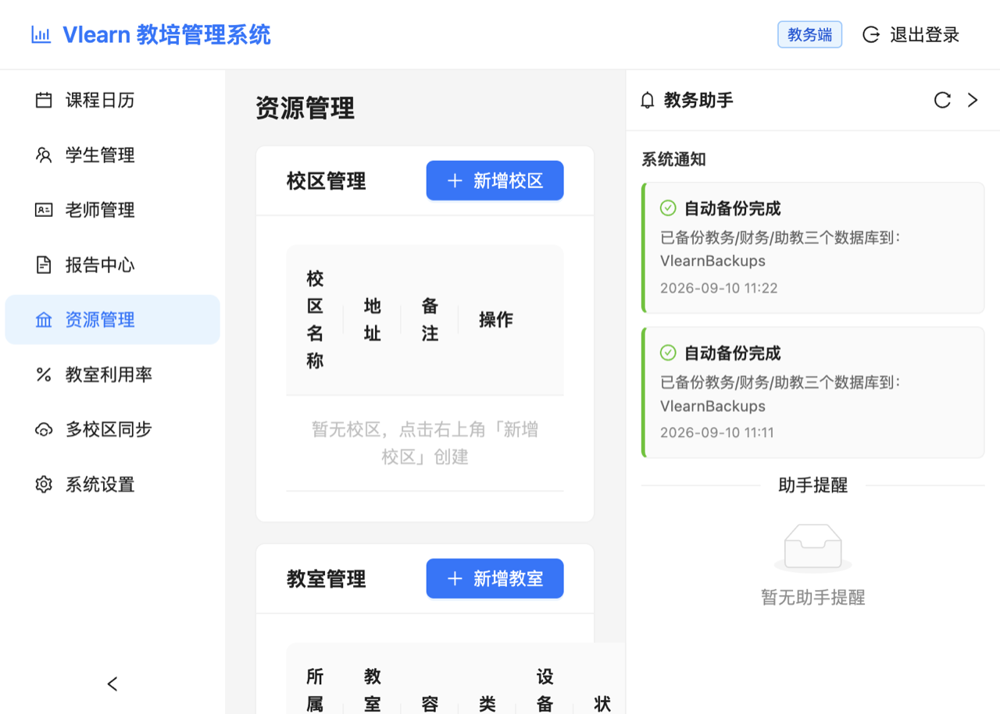
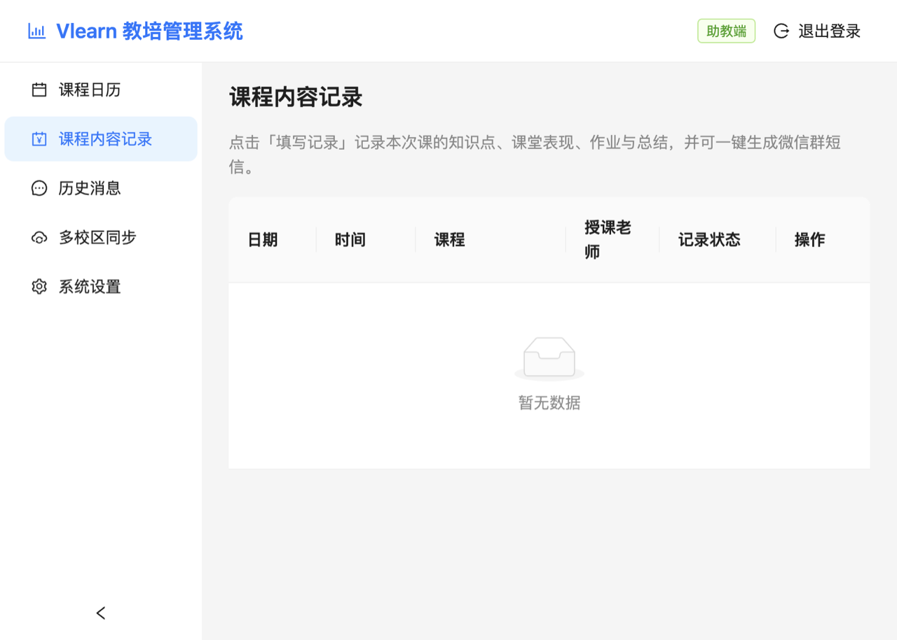
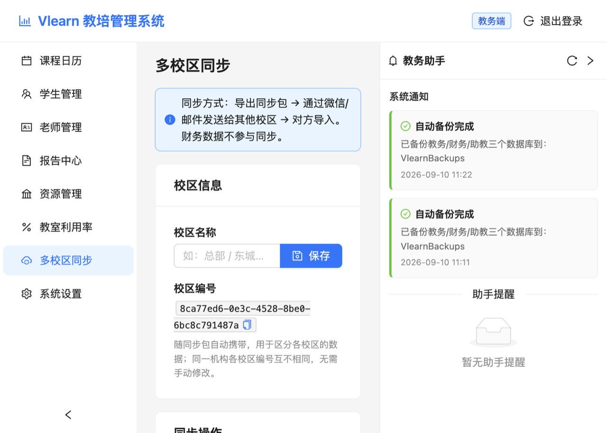
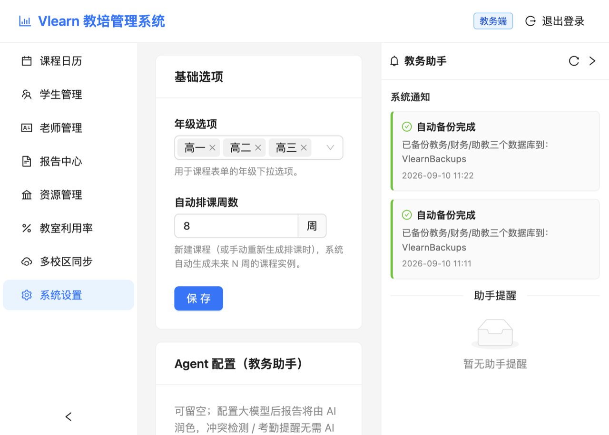

# Vlearn 教培管理系统 · 使用说明书（v4）

> 本说明书面向**没有编程基础**的用户。照着步骤做，10 分钟即可上手。
> 程序员开发文档见 [README.md](./README.md)。

---

## 目录

1. [软件简介](#一软件简介)
2. [安装与启动](#二安装与启动)
3. [角色登录（v2 新增）](#三角色登录v2-新增)
4. [快速上手（推荐先做这 6 步）](#四快速上手推荐先做这6步)
5. [教务模块操作指南](#五教务模块操作指南)
6. [财务模块操作指南](#六财务模块操作指南)
7. [助教模块操作指南（v2 新增）](#七助教模块操作指南v2-新增)
8. [智能助手（Agent，v2 新增）](#八智能助手agentv2-新增)
9. [多校区信息同步（v3 新增）](#九多校区信息同步v3-新增)
10. [系统设置](#十系统设置)
11. [数据安全与备份](#十一数据安全与备份)
12. [常见问题 FAQ](#十二常见问题-faq)

---

## 一、软件简介

Vlearn 是一款安装在您自己电脑上的**教培机构管理系统**，包含：

- **教务管理**：课程排课、学生档案、老师档案、考勤点名
- **财务管理**：学生缴费、老师课酬、对账检查、盈亏报表
- **助教协作**（v2 新增）：课程内容记录、一键生成微信群短信
- **智能助手**（v2 新增）：排课冲突提醒、考勤异常提醒、缴费逾期预警、AI 报告
- **多校区同步**（v3 新增）：同一机构多个校区可通过同步包互通教务与助教数据
- **财务精细化**（v4 新增）：个性化费用（折扣/赠送课时）、退费/转课/暂停、操作审计日志
- **经营分析**（v4 新增）：收支趋势/构成图表 + 明细下钻 + 老师简报一键生成
- **教室资源**（v4 新增）：校区与教室管理、教室排课冲突检测、利用率统计
- **定时备份**（v4 新增）：每周自动备份 + 保留策略，数据更安心
- **报表导出**：所有表格都能一键导出 Excel

**四个重要特点：**

1. **数据存在您自己的电脑上**，不需要联网，不会上传到任何服务器；
2. **三种角色、三个独立数据库**：教务、财务、助教各自登录、各看各的数据，互相无法越权；
3. **智能助手**：排课撞车、考勤异常、缴费逾期会自动提醒，配置大模型后还能自动生成报告和微信群短信；
4. **操作简单**：所有功能通过鼠标点击完成，不需要任何代码知识。

---

## 二、安装与启动

### Windows 电脑

1. 双击 `vlearn-4.0.0-win-x64.exe` 安装包，一路点"下一步"（安装位置保持默认即可）；
2. 安装完成后，双击桌面 **Vlearn教培管理系统** 图标启动。

### Mac 电脑

1. 双击 `vlearn-4.0.0-mac-arm64.dmg`，把图标拖进"应用程序"文件夹；
2. 打开时如提示"身份不明的开发者"，**右键图标 → 打开 → 再点打开**。

### 从旧版（1.x）升级

**直接双击新安装包覆盖安装即可，旧数据会自动迁移**：所有课程、学生、考勤、缴费记录都会原样保留，财务密码沿用旧密码；旧数据库会自动备份在电脑里，万一有问题可找技术人员恢复。启动时若提示迁移失败，请勿删除任何文件并联系技术支持。

---

## 三、角色登录（v2 新增）

启动软件后，首先看到**角色选择页**，三个入口：

| 入口 | 谁使用 | 能做什么 | 初始密码 |
| --- | --- | --- | --- |
| **教务登录** | 教务老师 | 排课、学生老师管理、考勤、报告 | `admin123` |
| **财务登录** | 财务老师 | 缴费、课酬、对账、盈亏报表 | `admin123` |
| **助教登录** | 助教老师 | 记录课程内容、生成微信群短信 | `assistant123` |

- 登录成功后，软件会**记住您的角色**，下次打开直接进入，不需要再输密码；
- 换人使用时，点右上角 **「退出登录」** 再重新登录；
- **三个角色数据完全隔离**：财务看不到助教的记录，助教也看不到任何金额；
- 初始密码请尽快修改（登录后在 **「系统设置 → 修改密码」** 中改）。

---

## 四、快速上手（推荐先做这 6 步）

### 第 1 步：教务登录，添加老师

1. 用教务角色登录（初始密码 `admin123`）；
2. 左侧菜单点 **「老师管理」** → **「新增老师」** → 输入姓名保存。

### 第 2 步：添加课程，自动排课

1. 左侧菜单点 **「课程日历」** → 右上角 **「课程管理」** → **「新增课程」**；
2. 填科目（如"数学"）、年级、班级号（如"A1班"）、默认授课老师、上课时间规则（如 周二 15:00-17:00）；
3. 保存后系统**自动生成未来 8 周课表**。
   - 若与老师已有课程时间冲突，系统会弹出提醒（可强制保存）。

### 第 3 步：添加学生并报课

1. 菜单点 **「学生管理」** → **「新增学生」** → 姓名、学校班级、勾选所报课程；
2. 若姓名与已有学生相似（如"张三"和"张 三"），系统会提醒可能重复。

### 第 4 步：给一节课点名

1. 打开 **「课程日历」**，点击彩色课程方块；
2. 详情弹窗里给每个学生选：**出勤 / 请假 / 缺勤**，选完立刻生效；全员到齐点 **「全部出勤」** 一键搞定。

### 第 5 步：财务登录，设置费用并算账

1. 右上角退出教务，用财务角色登录（初始密码 `admin123`）；
2. **「课程费用」**：给每门课填上课程费用（每节课收学生多少钱）和单次课酬（每节课付老师多少钱）；
3. **「学生缴费」** → **「自动计算应缴」**：系统按考勤自动算出每个学生该交多少钱；
4. **「老师课酬」** → **「自动计算应付」**：自动生成老师课酬记录。

### 第 6 步：助教登录，记录课程并发短信

1. 退出财务，用助教角色登录（初始密码 `assistant123`）；
2. 先到 **「系统设置」** 填好大模型 API 地址和密钥（发短信必须配置）；
3. 打开 **「课程日历」**，点击要记录的课程 → **「课程内容记录」** → 填写知识点、课堂表现、作业 → **「生成微信群短信」** → 复制发到家长群。

至此，三个角色的完整流程全部跑通！

---

## 五、教务模块操作指南

### 5.1 课程日历

- **月 / 周 / 日**三种视图右上角切换；方块颜色：🔵 正常、🟡 已调课、⚪ 灰色划掉=已取消；
- **点名**：点击课程方块 → 学生名单里选出勤/请假/缺勤，或一键「全部出勤」；
- **单次调课**：详情弹窗点 **「单次调课」** 改日期/时间/代课老师（只影响这一节）。保存前系统会**自动检测时间冲突**（老师或学生撞课），并可点 **「智能推荐时间」** 让助手推荐老师的空闲时段；
- **取消/恢复课程**：详情弹窗红色按钮取消，可随时恢复；
- **课程管理**（右上角）：新增/编辑/删除课程；修改上课时间规则后要点 **「重新生成排课」** 才生效（过去已上的课不受影响）；
- 右侧 **「教务助手」面板**：自动显示考勤异常（连续缺勤/请假）、信息不完整的学生/老师，可逐条关闭。

### 5.2 学生管理

- 新增/编辑/删除学生；点姓名看详情：基本信息 + 考勤统计 + 考勤历史（可导出 Excel）；
- 新增时自动做**相似姓名检测**（"小 明"会提醒已有"小明"）；
- 学费信息不在教务端显示（财务数据隔离）。

### 5.3 老师管理

- 新增/编辑/删除老师；点姓名看详情（累计授课次数、未来待上课程）；
- 课酬金额属于财务数据，请到财务端查看。

### 5.4 报告中心（v2 新增）

- 点 **「生成周报」/「生成月报」**：自动汇总课程、学生、老师数量与出勤率，生成文字报告；
- 配置大模型 API 后报告由 AI 润色（系统设置 → Agent 配置），未配置时使用系统模板；
- 报告可**复制**或**导出 Excel**。

### 5.5 考勤收费规则

| 状态 | 含义 | 收费规则 |
| --- | --- | --- |
| 出勤 | 正常上课 | 计费 ✅ |
| 请假 | 提前请假没来 | 不计费 ❌ |
| 缺勤 | 没来也没请假 | 默认计费 ✅（财务端设置可改） |
| 未标记 | 还没点名 | 不计费 |

---

## 六、财务模块操作指南

### 6.1 进入与退出

财务登录后，左侧菜单：仪表盘 / 课程费用 / 学生缴费 / 老师课酬 / 盈亏报表 / 系统设置。右上角「退出登录」可切换角色。

### 6.2 仪表盘

- 本月应缴/实缴/应付/实付/盈亏五张卡片，右上角可切换月份；

- **「对账检查」按钮**：一键核对所有"该收没收、该付没付"的记录，列出差异清单（可导出），全对上会提示"对账通过"。

### 6.3 课程费用

在课程列表点「编辑」行内修改**课程费用**（收学生）和**单次课酬**（付老师），再点保存。

### 6.4 学生缴费

- 新增记录：选学生 → 选课程（只显示该生报的课）→ 应缴自动填入（可改）→ 填实缴、方式、日期；
- **「自动计算应缴」**：按考勤批量算出应缴（出勤计费、请假免费、缺勤按设置），**不会覆盖已填的实缴金额**；
- **异常交易提醒**：录入金额远超平时、或反复修改同一记录时，保存前会弹警告确认；
- 支持按学生/课程筛选、导出 Excel、底部合计。

### 6.5 老师课酬

- 新增记录：选老师 → 选课次 → 应付自动填入（= 单次课酬，代课付给代课老师）→ 填实付、日期；
- **「自动计算应付」**：为每节未取消的课生成课酬记录；
- 同样有异常金额/频繁修改提醒。

### 6.6 盈亏报表

- 按年份查看月度收入（学生实缴）、支出（老师实付）、净盈亏与全年合计；
- **「AI 趋势分析」按钮**：生成未来 3 个月的盈亏预测报告（配置大模型后为 AI 分析，否则为系统模板）；
- 支持导出 Excel。

---

### 6.7 个性化费用（v4 新增）

同一个班的学生可以有不同的收费标准。在「学生缴费」页点 **「个性化费用」**：

- 为某个学生某门课设置**单价（元/次）**、**折扣类型**（无折扣/老生优惠/团报优惠/赠送/其他）、**赠送课时**（免费次数）、备注；
- 修改会弹**二次确认**（显示修改前后对比），并自动写入操作日志；
- 未设置个性化费用的学生按课程标准费用计费；
- **新的应缴公式**：`应缴 = max(0, 计费次数 − 赠送课时) × 单价`（计费次数 = 出勤 + 缺勤（可配置），请假始终免费）。

### 6.8 缴费记录锁定（v4 新增）

- **有实缴金额的记录自动锁定**，锁定后「自动计算应缴」不会改动它（只能手动修改）；
- 也可手动锁定/解锁（表格"锁定"列操作按钮）；
- 锁定是保护：防止历史已缴费记录被批量重算误改。

### 6.9 退费 / 转课 / 暂停（v4 新增）

「学生缴费」页工具栏 **「退费/转课/暂停」**：

| 操作 | 效果 |
| --- | --- |
| 暂停/恢复 | 暂停期间该学生不参与考勤点名、不计费；恢复后照常 |
| 退费 | 自动计算：`退费 = 已缴总额 − 已消耗费用`（消耗 = max(0, 出勤次数−赠送课时) × 单价），生成退费记录并把课程状态置为"已退费" |
| 转课 | 原课程按退费逻辑结清余额（正数补缴、负数退还），新课程自动建立关联，重新按新课程规则计费 |

以上操作均需**二次确认**并**自动记录操作日志**（系统设置 → 操作日志，财务可见）。

### 6.10 老师课酬差异化（v4 新增）

课酬取值优先级：**课次覆盖值 > 老师默认课酬 > 课程标准**。在「老师课酬」页点 **「课酬标准」** 设置：

- 给每位老师设置**默认课酬**（元/次）；
- 对单个课次（如代课）设置**覆盖课酬**，优先于其他规则；
- 每笔课酬记录都显示**标准来源**（实例覆盖/老师默认/课程标准）。

### 6.11 经营分析（v4 新增）

财务菜单新增 **「经营分析」**：

- **月度收支盈亏趋势图**：月/季/年粒度切换 + 自定义日期范围，三张图联动；
- **收入构成**（按科目/按缴费方式切换）与**支出构成**（按老师/按课程切换）环形图；
- **点击某月柱子下钻**：查看该时段缴费明细与课酬明细（可导出 Excel）。

### 6.12 老师简报（v4 新增）

财务菜单新增 **「老师简报」**——由财务生成、转发给任课老师（老师本人不登录系统）：

1. 选择老师、时间范围，勾选要包含的内容（基本信息/课程安排/学生出勤/课酬汇总）；
2. 勾选"课酬汇总"会**二次确认**，且简报中不含任何学生缴费信息；
3. 生成后预览 → **复制为文本**发微信，或**导出 PDF**。

### 6.13 校区与教室（v4 新增，教务菜单）

- **「资源管理」**：维护校区（名称/地址）与教室（所属校区/名称/容量/类型/设备/状态）；
- 课程可设置**默认教室**，调课时可单独更换教室；
- **教室参与排课冲突检测**：同一教室同一时间排两门课会弹冲突提醒；
- **「教室利用率」**：按校区查看每间教室的已排课时间与利用率（>80% 提示紧张），帮助合理排课。

---

## 七、助教模块操作指南（v2 新增）

### 7.1 课程日历（只读）

助教可以查看所有课程、学生名单和考勤状态，但**不能修改**（没有点名/调课按钮）。

### 7.2 课程内容记录

两种进入方式：
1. 左侧菜单 **「课程内容记录」**：按时间列出近期课程，标绿的是已记录的，点 **「填写记录」** 开始；
2. 课程日历里点击课程方块 → **「课程内容记录」**。

填写四个栏位（都可留空）：
- **知识点**：输入后按回车添加，可加多个（如：函数单调性、导数应用）；
- **课堂表现**：如"整体良好，张三回答问题积极"；
- **当日作业**：如"练习册 P45-46"；
- **当日总结**：本节课整体情况。

点 **「保存记录」** 存好。

### 7.3 生成微信群短信

1. 先在 **「系统设置 → 大模型 API 配置」** 填好 API 地址与密钥（必填，否则此功能不可用）；
2. 在课程记录页面点 **「生成微信群短信」**；
3. 几秒后弹出生成好的短信（格式类似"【课程通知】今日数学A1班课程总结：知识点…作业…请家长督促完成"），点 **「复制」** 粘贴到家长微信群即可；
4. 生成结果自动保存在 **「历史消息」** 页面，可随时回来复制或删除。

> 短信内容由 AI 根据您填写的记录生成，**不填的内容不会编造**；生成失败不会保存历史。

### 7.4 作业批改（未开发）

课程记录页底部有一个灰色按钮 **「作业批改（未开发）」**，点击提示"该功能即将上线，敬请期待"。这是预留功能，本版本暂未开放。

---

## 八、智能助手（Agent，v2 新增）

系统内置两位"智能助手"，**检测类功能不联网也能工作**，文本生成类功能配置大模型后由 AI 完成。

### 8.1 教务助手（右侧面板）

| 功能 | 触发方式 | 说明 |
| --- | --- | --- |
| 排课冲突检测 | 保存课程/调课时自动 | 老师或学生时间撞课弹提醒，可强制保存 |
| 智能调课建议 | 调课时点"智能推荐时间" | 推荐未来 7 天老师的空闲时段 |
| 考勤异常提醒 | 自动（登录时 + 每 4 小时） | 连续 3 次缺勤/请假的学生在侧边栏提醒 |
| 信息补全提示 | 自动 | 未填班级、未报课的学生、未排课的老师 |
| 相似姓名检测 | 新增学生/老师时 | "张三"vs"张 三"提醒重复 |
| 周报/月报 | 报告中心按钮 | 汇总数据生成文字报告 |

### 8.2 财务助手（右侧面板）

| 功能 | 触发方式 | 说明 |
| --- | --- | --- |
| 对账检查 | 仪表盘按钮（手动） | 应缴≠实缴、应付≠实付的差异清单 |
| 缴费逾期预警 | 自动 | 欠费且未来 7 天有课的学生提醒 |
| 异常交易检测 | 录入/修改时自动 | 金额超平时 3 倍、频繁修改等警告 |
| 盈亏趋势分析 | 报表页按钮 | 未来 3 个月盈亏预测 |
| 智能报表/凭证 | 各列表"导出 Excel"旁可用 | 按当前筛选生成标准格式文本 |

### 8.3 开关与灵敏度

各功能的开关、阈值（连续缺勤次数、逾期天数、金额倍数）都在各自角色的 **「系统设置 → Agent 配置」** 里，关闭后不再触发。

### 8.4 大模型 API 配置（三个角色各自配置）

- **助教**：必须配置（否则无法生成短信）；
- **教务 / 财务**：可留空，检测类功能不受影响，报告类功能使用系统模板；
- 填写内容：**API 地址**（如 `https://api.deepseek.com/v1`）与 **API 密钥**，两者都来自您的大模型服务商（DeepSeek、通义千问、OpenAI 等 OpenAI 兼容接口均可）。

---

## 九、多校区信息同步（v3 新增）

同一机构有多个校区时，可以通过**同步包**让各校区共享教务与助教数据（课程、学生、老师、排课、考勤、课程记录）。左侧菜单「多校区同步」对教务与助教角色可见。

### 9.1 同步方式（三步）

1. **导出**：在任一校区点「导出同步包」，生成一个 `.json` 文件；
2. **发送**：把该文件通过微信/邮件发给其他校区；
3. **导入**：对方点「导入同步包」选择收到的文件，数据自动合并。

> 建议节奏：每天或每周固定导出一到两次，"谁改动谁导出"即可保持各校区一致。

### 9.2 合并规则（请务必了解）

| 情况 | 结果 |
| --- | --- |
| 同一记录两边都改过 | **以最近修改为准** |
| 两个校区各自新建的数据 | **全部保留**（编号冲突时自动分配新编号，数据不丢失） |
| 某校区删除了记录 | 导入后本机同步删除 |
| 登录密码、大模型密钥 | **不参与同步**，各校区自行管理 |
| 财务数据（缴费/课酬/盈亏） | **不参与同步**，保留在各校区本地 |

### 9.3 校区信息

- **校区名称**：如"总部"、"东城校区"，方便识别同步包来源；
- **校区编号**：系统自动生成，随同步包携带用于区分各校区数据，无需手动修改。

### 9.4 同步历史

页面底部会记录每次导出/导入的时间、来源校区和合并结果（新增/更新/删除数量），便于核对。

---

## 十、系统设置

各角色登录后左侧菜单点「系统设置」，分节内容因角色而异：

| 板块 | 教务 | 财务 | 助教 |
| --- | --- | --- | --- |
| 基础选项 | 年级选项、自动排课周数 | 缴费方式、缺勤是否收费 | — |
| Agent 配置 | 功能开关 + 阈值 + API | 功能开关 + 阈值 + API | API 地址与密钥 |
| 修改密码 | ✅ | ✅ | ✅ |
| 数据备份与恢复 | ✅ | ✅ | ✅ |
| 备份设置（v4） | ✅ | ✅ | ✅ |
| 操作日志（v4） | 仅财务 | — | — |
| 关于 | 版本号 | 版本号 | 版本号 |

- **修改密码**：输入当前密码 → 新密码（至少 6 位）→ 确认 → 保存；
- **备份**：点「备份数据」选择保存位置，会生成**三个数据库文件**（教务/财务/助教各一个）；
- **恢复**：依次选择三个备份文件，确认后软件自动刷新；
- **备份设置（v4 新增）**：自动备份开关、周期（每周几 + 时间）、备份目录、保留份数（默认 4 份）；点「立即备份」随时手动备份；备份成功/失败会在右侧面板"系统通知"区提示；错过周期时下次启动自动补备份。

---

## 十一、数据安全与备份

- 数据保存在本机，**不联网、不上传**；
- **强烈建议每周备份一次**：设置 → 备份数据 → 存到 U 盘或云盘；
- 换电脑：新电脑装好软件 → 设置 → 恢复数据 → 依次选三个备份文件；
- 覆盖安装新版本**不会影响数据**；卸载软件前请先备份；
- 三个角色的数据是三个独立文件，日常使用时教务和财务互看不到对方数据是**正常设计**。

---

## 12、常见问题 FAQ

**Q1：忘了登录密码怎么办？**
A：软件内无法自助找回。请联系技术人员：备份数据后由技术人员重置密码（教务/财务恢复为 admin123，助教恢复为 assistant123）。

**Q2：从旧版升级，数据会不会丢？**
A：不会。安装新版后第一次启动会自动迁移旧数据，旧数据库还会在电脑里留一份备份。

**Q3：修改了课程的上课时间，课表没变？**
A：已生成的课表不会自动变。在「课程日历 → 课程管理」里点该课程的「重新生成排课」。

**Q4：为什么教务端看不到学费信息？**
A：设计如此——三种角色数据隔离，金额信息只有财务端可见。

**Q5：生成微信群短信报错怎么办？**
A：先检查「系统设置」里是否填了 API 地址和密钥；再确认电脑能上网。生成失败不会保存历史，可重试。

**Q6：报告显示"系统模板"是什么意思？**
A：说明还没有配置大模型 API，报告由系统自动汇总生成；配置后会自动变成 AI 润色版。

**Q7：导出的 Excel 在哪里？**
A：点"导出 Excel"后由您选择保存位置，文件名 `Vlearn_模块名_日期.xlsx`。

**Q8：教室冲突是怎么检测的？**
A：保存课程或调课时，系统会同时检测老师时间、学生时间、教室占用三类冲突并弹窗提醒（可强制保存）。

**Q9：可以两台电脑同时用同一份数据吗？**
A：这是单机软件，数据不共享。建议固定一台"主电脑"录入，定期备份。

---

祝您使用愉快！如有其他问题，请联系软件提供方。
